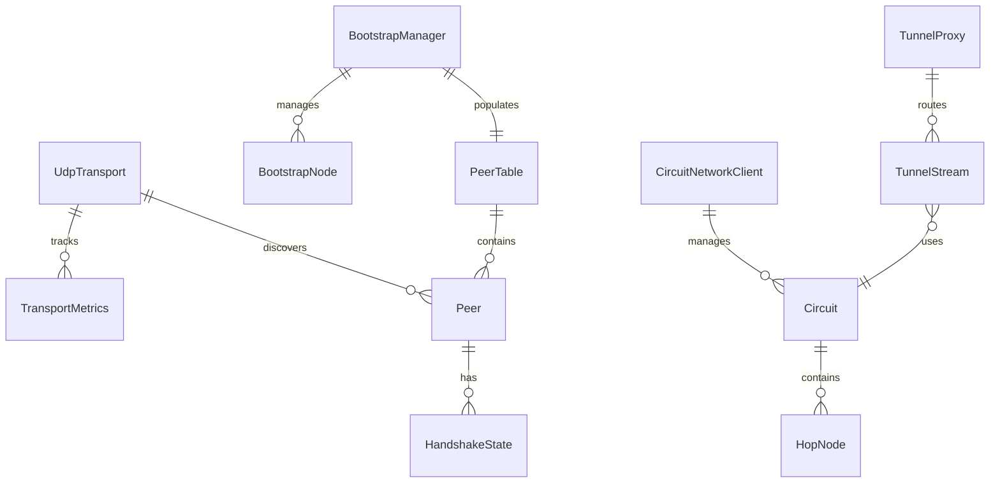

# Data Model: Network Transport Layer

**Feature**: 002-network-transport  
**Date**: January 2, 2026

## Entity Overview



## Entities

### UdpTransport

Core UDP socket management for sending/receiving IPv8 protocol messages.

| Field | Type | Description | Constraints |
|-------|------|-------------|-------------|
| LocalPort | ushort | Bound UDP port | Range: 1024-65535, Default: 0 (random available port per py-ipv8 behavior) |
| IsRunning | bool | Transport active state | - |
| BytesSent | long | Total bytes transmitted | Monotonic counter |
| BytesReceived | long | Total bytes received | Monotonic counter |
| PacketsSent | long | Total packets transmitted | Monotonic counter |
| PacketsReceived | long | Total packets received | Monotonic counter |

**Validation**: Port must not be in use. Socket bind must succeed.

### BootstrapNode

Known entry point into the Tribler network.

| Field | Type | Description | Constraints |
|-------|------|-------------|-------------|
| Address | string | IPv4 address | Valid IPv4 format |
| Port | ushort | UDP port | Range: 6421-6528 |
| LastContactAttempt | DateTime? | When last contacted | - |
| LastSuccessfulContact | DateTime? | When last responded | - |
| IsReachable | bool | Currently responsive | - |

**Hardcoded Nodes** (validated from py-ipv8 source):
- 130.161.119.206:6421, 130.161.119.206:6422 (TU Delft)
- 131.180.27.155:6423, 131.180.27.156:6424 (TU Delft)
- 131.180.27.161:6427, 131.180.27.161:6521, 131.180.27.161:6522 (TU Delft)
- 131.180.27.162:6523, 131.180.27.162:6524 (TU Delft)
- 130.161.119.215:6525, 130.161.119.215:6526 (TU Delft)
- 130.161.119.201:6527, 130.161.119.201:6528 (TU Delft)

### PeerTable

Collection of discovered peers with reliability tracking.

| Field | Type | Description | Constraints |
|-------|------|-------------|-------------|
| Peers | Dictionary<string, Peer> | Peer lookup by public key | - |
| MinimumPeerCount | int | Required peers for circuits | Default: 20 |
| MaxPeerCount | int | Maximum tracked peers | Default: 200 |
| LastRefresh | DateTime | Last introduction request | - |
| RefreshIntervalSeconds | int | Peer refresh period | Default: 300 (5 min) |

### Peer (Extended)

Existing Peer entity with additional reliability metrics.

| Field | Type | Description | Constraints |
|-------|------|-------------|-------------|
| PublicKey | byte[32] | Ed25519 public key | Exactly 32 bytes |
| IPv4Address | uint | Network address | Big-endian |
| Port | ushort | UDP port | Big-endian |
| IsHandshakeComplete | bool | Handshake finished | - |
| HandshakeState | HandshakeState | Current handshake phase | - |
| DiscoveredAt | DateTime | First seen timestamp | - |
| LastSeenAt | DateTime | Last activity timestamp | - |
| RttMs | double | Round-trip time (ms) | Positive |
| RttVariance | double | RTT standard deviation | **NEW** |
| SuccessCount | int | Successful interactions | **EXISTING** |
| FailureCount | int | Failed interactions | **EXISTING** |
| ReliabilityScore | double | Computed reliability | Range: 0.0-1.0 |
| IsRelayCandidate | bool | Suitable for circuits | - |
| ProtocolVersion | string | Reported IPv8 version | **NEW**: e.g., "2.0" |

### HandshakeState

State machine for four-message handshake.

| State | Description | Next States |
|-------|-------------|-------------|
| None | Not started | IntroductionRequestSent |
| IntroductionRequestSent | Awaiting response | IntroductionResponseReceived, Failed |
| IntroductionResponseReceived | Got peer list | PunctureRequestSent, Complete |
| PunctureRequestSent | NAT traversal started | PunctureReceived, Failed |
| PunctureReceived | NAT hole established | Complete |
| Complete | Handshake successful | - |
| Failed | Handshake failed | None (retry) |

### CircuitNetworkClient

Handles network transmission of circuit messages.

| Field | Type | Description | Constraints |
|-------|------|-------------|-------------|
| Transport | ITransport | UDP transport reference | Required |
| PendingCreates | Dictionary<uint, TaskCompletionSource> | Awaiting CREATED | - |
| PendingExtends | Dictionary<uint, TaskCompletionSource> | Awaiting EXTENDED | - |
| HeartbeatIntervalMs | int | Keepalive period | Default: 30000 |

### TunnelStream

TCP-over-circuit tunnel for BitTorrent traffic.

| Field | Type | Description | Constraints |
|-------|------|-------------|-------------|
| CircuitId | uint | Associated circuit | Must be established |
| StreamId | ushort | Multiplexed stream ID | Unique per circuit |
| RemoteEndpoint | IPEndPoint | Destination address | - |
| BytesSent | long | Tunneled bytes out | - |
| BytesReceived | long | Tunneled bytes in | - |
| CreatedAt | DateTime | Stream creation time | - |
| IsActive | bool | Stream still open | - |

## State Transitions

### Circuit Lifecycle (Network)

```
[No Circuit] 
    → CREATE sent → [Creating]
    → CREATED received → [FirstHopEstablished]
    → EXTEND sent → [Extending]
    → EXTENDED received → [Established] (if all hops done)
    → Heartbeat timeout → [Failed] → DESTROY sent → [Destroyed]
```

### Handshake Lifecycle

```
[New Peer Discovered]
    → Send introduction-request → [AwaitingResponse]
    → Receive introduction-response → [ResponseReceived]
    → (If NAT required) Send puncture-request → [AwaitingPuncture]
    → Receive puncture → [Complete]
    → Timeout at any stage → [Failed] → Retry or mark unreachable
```

