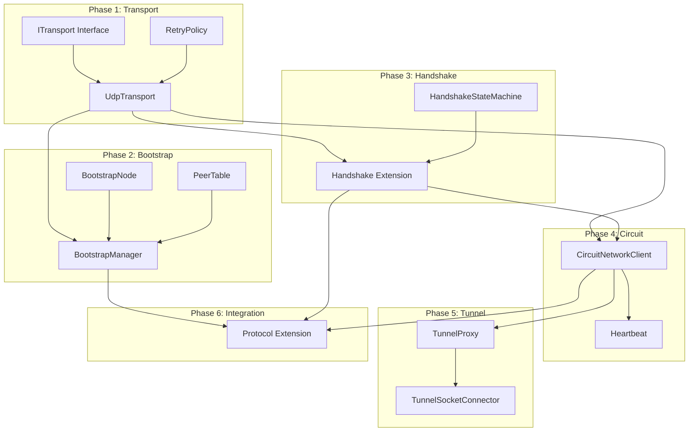

# Implementation Tasks: Network Transport Layer

**Feature**: 002-network-transport  
**Branch**: `002-network-transport`  
**Generated**: January 2, 2026

## Task Legend

- `[P]` = Parallel-safe (can run alongside other `[P]` tasks)
- `[US#]` = Maps to User Story # from spec.md
- `[FR-###]` = Maps to Functional Requirement from spec.md
- `[SC-###]` = Maps to Success Criteria from spec.md

## Phase 1: Transport Foundation (US1)

Core UDP transport layer that all other components depend on.

### T001 - ITransport Interface and RetryPolicy
- [X] T001 [P] [US1] [FR-004] Create `src/TunnelFin/Networking/Transport/ITransport.cs` interface per contracts/transport-api.yaml
- [X] T002 [P] [US1] [FR-004] Create `src/TunnelFin/Networking/Transport/RetryPolicy.cs` with exponential backoff (100ms initial, 5s max, 5 retries, 25% jitter)
- [X] T003 [P] [US1] Create `src/TunnelFin/Networking/Transport/DatagramReceivedEventArgs.cs` for received packet events
- [X] T004 [US1] Create `tests/TunnelFin.Tests/Networking/Transport/RetryPolicyTests.cs` - test backoff timing, jitter bounds, max retries

### T005-T008 - UdpTransport Implementation
- [X] T005 [US1] [FR-001] [FR-002] Create `src/TunnelFin/Networking/Transport/UdpTransport.cs` implementing ITransport with Socket class
- [X] T006 [US1] [FR-001] Implement StartAsync: bind to random available port by default (per py-ipv8 behavior), support configurable port override
- [X] T007 [US1] [FR-002] Implement async receive loop with pinned buffers for zero-copy receive
- [X] T008 [US1] [FR-003] Implement SendAsync with MTU handling (1472 bytes for IPv4)

### T009-T011 - Transport Metrics and Tests
- [X] T009 [P] [US1] [FR-023] Create `src/TunnelFin/Networking/Transport/TransportMetrics.cs` (packets/bytes sent/received counters)
- [X] T010 [US1] Create `tests/TunnelFin.Tests/Networking/Transport/UdpTransportTests.cs` - port binding, send/receive, metrics
- [X] T011 [US1] [SC-001] Verify transport starts within timeout, handles concurrent operations

## Phase 2: Bootstrap Discovery (US2)

Bootstrap node contact and peer table management.

### T012-T015 - Bootstrap Infrastructure
- [x] T012 [P] [US2] Create `src/TunnelFin/Networking/Bootstrap/BootstrapNode.cs` with validated TU Delft nodes (ports 6421-6528)
- [x] T013 [P] [US2] Create `src/TunnelFin/Networking/Bootstrap/BootstrapStatus.cs` enum (NotStarted, Contacting, Discovering, Ready, Failed)
- [x] T014 [US2] Create `src/TunnelFin/Networking/Bootstrap/IPeerTable.cs` interface per contracts/transport-api.yaml
- [x] T015 [US2] [FR-007] Create `src/TunnelFin/Networking/Bootstrap/PeerTable.cs` implementing IPeerTable with reliability tracking

### T016-T019 - BootstrapManager Implementation
- [x] T016 [US2] Create `src/TunnelFin/Networking/Bootstrap/IBootstrapManager.cs` interface per contracts/transport-api.yaml
- [x] T017 [US2] [FR-005] [FR-006] Create `src/TunnelFin/Networking/Bootstrap/BootstrapManager.cs` with hardcoded bootstrap nodes
- [x] T018 [US2] [FR-006] Implement DiscoverPeersAsync: contact bootstrap nodes, send introduction-request, parse response (placeholder - requires Phase 3)
- [x] T019 [US2] [FR-008] Implement RefreshPeersAsync: periodic peer table refresh (5 min interval)

### T020-T022 - Bootstrap Tests
- [x] T020 [US2] Create `tests/TunnelFin.Tests/Networking/Bootstrap/BootstrapNodeTests.cs` - node validation, reachability tracking
- [x] T021 [US2] Create `tests/TunnelFin.Tests/Networking/Bootstrap/PeerTableTests.cs` - add/remove, reliability scoring, relay selection
- [x] T022 [US2] [SC-001] [SC-002] Create `tests/TunnelFin.Tests/Networking/Bootstrap/BootstrapManagerTests.cs` - discovery flow, timeout handling

## Phase 3: Live Handshake Protocol (US3)

Four-message handshake over real network.

### T023-T026 - Handshake State Machine
- [x] T023 [P] [US3] Create `src/TunnelFin/Networking/IPv8/HandshakeState.cs` enum (None, IntroRequestSent, IntroResponseReceived, etc.)
- [x] T024 [US3] Create `src/TunnelFin/Networking/IPv8/HandshakeStateMachine.cs` - per-peer state tracking with timeouts
- [x] T025 [US3] [FR-012] Implement handshake timeout (10 seconds) with state transitions
- [x] T026 [US3] [FR-013a] Create `src/TunnelFin/Networking/IPv8/ProtocolVersion.cs` - v3.x version handling, compatibility check

### T027-T031 - Extend Existing Handshake
- [x] T027 [US3] [FR-009] Extend `src/TunnelFin/Networking/IPv8/Handshake.cs` - wire to ITransport for actual send/receive
- [x] T028 [US3] [FR-010] [FR-011] Implement message signing with Ed25519 and signature verification
- [x] T029 [US3] [FR-013] Implement NAT puncture flow: puncture-request via intermediary, puncture reception
- [x] T030 [US3] Extend `src/TunnelFin/Networking/IPv8/Peer.cs` - add RttVariance, ProtocolVersion, NatType fields
- [x] T030a [US3] Implement NAT type inference from puncture success/failure patterns (>50% failure = likely symmetric NAT, trigger relay-only mode)

### T031-T033 - Handshake Tests
- [x] T031 [US3] Create `tests/TunnelFin.Tests/Networking/IPv8/HandshakeStateMachineTests.cs` - state transitions, timeouts
- [x] T032 [US3] [SC-003] Extend `tests/TunnelFin.Tests/Networking/HandshakeTests.cs` - live handshake success rate validation
- [x] T033 [US3] Create `tests/TunnelFin.Tests/Networking/IPv8/ProtocolVersionTests.cs` - version negotiation, rejection

## Phase 4: Circuit Network Operations (US4) ✅

Circuit establishment over real network connections.

### T034-T037 - CircuitNetworkClient ✅
- [x] T034 [US4] Create `src/TunnelFin/Networking/Circuits/ICircuitNetworkClient.cs` interface per contracts/transport-api.yaml
- [x] T035 [US4] [FR-014] Create `src/TunnelFin/Networking/Circuits/CircuitNetworkClient.cs` - CREATE message over UDP
- [x] T036 [US4] [FR-015] [FR-016] Implement SendExtendAsync: EXTEND through circuit, handle EXTENDED response
- [x] T037 [US4] [FR-018] Implement SendDestroyAsync: clean circuit teardown

### T038-T041 - Circuit Heartbeat and Response Handling ✅
- [x] T038 [US4] [FR-017] Create `src/TunnelFin/Networking/Circuits/CircuitHeartbeat.cs` - 30s keepalive timer
- [x] T039 [US4] Create response types: `CreateResponse.cs`, `ExtendResponse.cs` in Circuits folder
- [x] T040 [US4] [FR-018a] Extend `src/TunnelFin/Networking/Circuits/CircuitManager.cs` - maintain 2-3 concurrent circuits
- [x] T041 [US4] [FR-018b] Implement relay reliability tracking in circuit selection

### T042-T044 - Circuit Network Tests ✅
- [x] T042 [US4] Create `tests/TunnelFin.Tests/Networking/Circuits/CircuitNetworkClientTests.cs` - CREATE/EXTEND/DESTROY
- [x] T043 [US4] Create `tests/TunnelFin.Tests/Networking/Circuits/CircuitHeartbeatTests.cs` - keepalive, timeout detection
- [x] T044 [US4] [SC-004] [SC-007] Extend `tests/TunnelFin.Tests/Networking/CircuitManagerTests.cs` - network establishment

## Phase 5: Traffic Routing (US5) ✅

BitTorrent traffic tunneling through circuits.

### T045-T048 - Tunnel Infrastructure ✅
- [x] T045 [P] [US5] Create `src/TunnelFin/Networking/Tunnel/ITunnelProxy.cs` interface per contracts/transport-api.yaml
- [x] T046 [US5] [FR-019] Create `src/TunnelFin/Networking/Tunnel/TunnelProxy.cs` - TCP-over-circuit proxy
- [x] T047 [US5] [FR-020] Create `src/TunnelFin/Networking/Tunnel/LayeredEncryption.cs` - per-hop encryption/decryption
- [x] T048 [US5] Create `src/TunnelFin/Networking/Tunnel/TunnelStream.cs` - multiplexed stream over circuit

### T049-T052 - MonoTorrent Integration ✅
- [x] T049 [US5] [FR-021] Create `src/TunnelFin/Networking/Tunnel/TunnelSocketConnector.cs` implementing ISocketConnector
- [x] T050 [US5] Create `src/TunnelFin/Networking/Tunnel/TunnelSocket.cs` - Socket wrapper for circuit I/O
- [x] T051 [US5] [FR-022] Implement direct connection fallback with consent tracking (AllowNonAnonymousFallback setting)
- [x] T052 [US5] Wire TunnelSocketConnector into MonoTorrent engine configuration (via Factories.WithSocketConnectorCreator)

### T053-T055 - Traffic Routing Tests ✅
- [x] T053 [US5] Create `tests/TunnelFin.Tests/Networking/Tunnel/TunnelProxyTests.cs` - tunnel creation, data routing (10 tests)
- [x] T054 [US5] Create `tests/TunnelFin.Tests/Networking/Tunnel/LayeredEncryptionTests.cs` - encrypt/decrypt per hop (10 tests)
- [x] T055 [US5] [SC-005] [SC-006] Create `tests/TunnelFin.Tests/Networking/Tunnel/TunnelStreamTests.cs` - throughput, packet loss (10 tests)

## Phase 6: Protocol Integration (US1-US5)

Wire Protocol.cs to use network transport for real communication.

### T056-T059 - Protocol Extension
- [ ] T056 [US1] Extend `src/TunnelFin/Networking/IPv8/Protocol.cs` - inject ITransport dependency
- [ ] T057 [US1] Implement InitializeAsync: start transport, trigger bootstrap discovery
- [ ] T058 [US3] Implement PerformHandshakeAsync: use HandshakeStateMachine over real network
- [ ] T059 [US1] [FR-024] Implement configurable logging without IP exposure in default mode

### T060-T062 - Configuration Extension
- [ ] T060 [P] Extend `src/TunnelFin/Configuration/AnonymitySettings.cs` - add UdpPort, BootstrapTimeout, HeartbeatInterval
- [ ] T061 Create `src/TunnelFin/Networking/Transport/TransportConfiguration.cs` - transport-specific settings
- [ ] T062 [SC-008] Implement circuit recovery: detect failure, re-establish within 30s

## Phase 7: Integration Tests

Live network tests against Tribler network.

### T063-T066 - Integration Test Suite
- [ ] T063 [SC-001] Create `tests/TunnelFin.Tests/Integration/BootstrapIntegrationTests.cs` - real bootstrap node contact
- [ ] T064 [SC-002] [SC-003] Create `tests/TunnelFin.Tests/Integration/HandshakeIntegrationTests.cs` - real peer handshake
- [ ] T065 [SC-004] [SC-007] Create `tests/TunnelFin.Tests/Integration/CircuitIntegrationTests.cs` - real circuit establishment
- [ ] T066 [SC-005] Create `tests/TunnelFin.Tests/Integration/TunnelIntegrationTests.cs` - IP hiding verification

### T067-T068 - End-to-End Verification
- [ ] T067 [SC-009] Audit all files for TODO comments and placeholder implementations
- [ ] T068 Run full test suite, verify all success criteria pass

## Task Dependencies

## Summary

| Phase | Tasks | New Files | Test Files | Key FRs |
|-------|-------|-----------|------------|---------|
| 1. Transport | T001-T011 | 5 | 2 | FR-001, FR-002, FR-003, FR-004 |
| 2. Bootstrap | T012-T022 | 6 | 3 | FR-005, FR-006, FR-007, FR-008 |
| 3. Handshake | T023-T033 (+T030a) | 4 | 3 | FR-009, FR-010, FR-011, FR-012, FR-013 |
| 4. Circuit | T034-T044 | 5 | 3 | FR-014, FR-015, FR-016, FR-017, FR-018 |
| 5. Tunnel | T045-T055 | 6 | 3 | FR-019, FR-020, FR-021, FR-022 |
| 6. Protocol | T056-T062 | 2 | 0 | FR-023, FR-024 |
| 7. Integration | T063-T068 | 0 | 4 | SC-001 through SC-009 |
| **Total** | **69** | **28** | **18** | **24 FRs, 9 SCs** |

